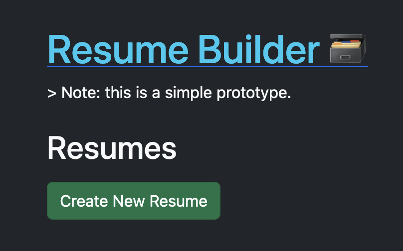
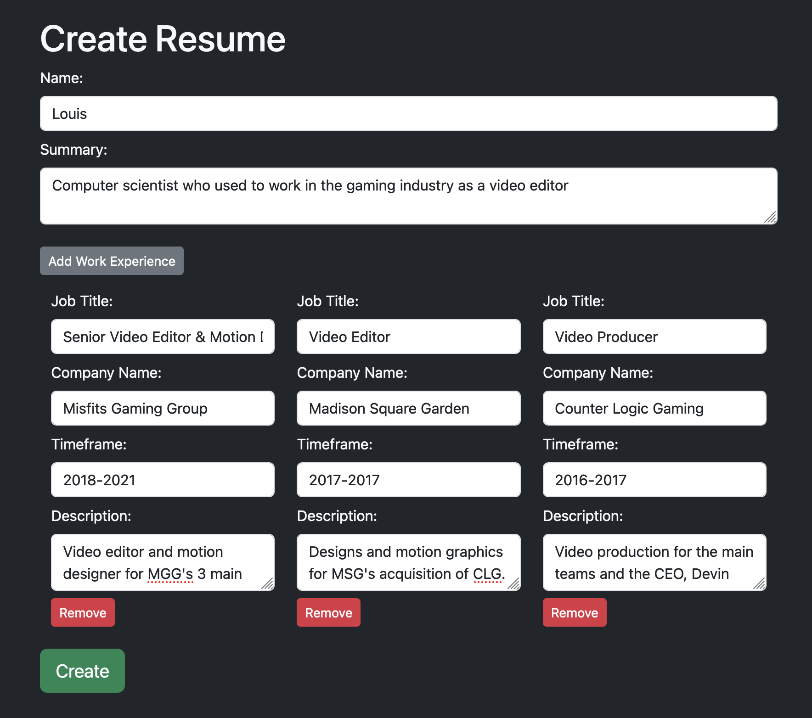
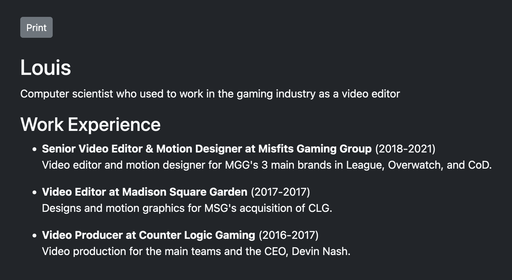

# Resume Builder

> This repository was originally created as a coding challenge for a job interview. The original instructions can be found in [INSTRUCTIONS.md](INSTRUCTIONS.md).

This full-stack application allows users to create, edit, and delete resumes. Resumes are stored in a MongoDB database and can be viewed in a formatted way.

## Technologies Used

- Docker
- **Frontend**
  - Vue.js
  - Vuex
  - Vue Router
  - BootstrapVue
- **Backend**
  - Node.js
  - Express
  - Mongoose
  - MongoDB

## Setup Instructions

1. **Clone** this repository.
2. Run `docker compose up -d` in the **root** directory (with Docker open).
3. Change into the `server` directory and run `npm i`.
4. Run `npm run dev` to start the server.
5. Change into the `client` directory and run `npm i`.
6. Run `npm run serve` to start the client.
7. Navigate to `localhost:8080` in your browser.

## Walkthrough

### Homepage

Upon first opening the application, you will be greeted with an empty list of resumes. You can create a new resume by clicking the "Create New Resume" button.

### Create Resume

Information for the following fields can be inserted upon creating a new resume:

- **Name**
- **Summary**
- **Work Experience** (multiple)
  - Job Title
  - Company Name
  - Timeframe (start and end date)
  - Description

Upon finishing all fields in the form, create it by clicking the "Create" button.

### Resume Options

Now that there is a resume in the list, you can choose to **view** it, **edit** it, or **delete** it on the homepage. You can also create additional new resumes by clicking the "Create New Resume" button again.

Viewing a resume will take you to a page that displays the resume in a formatted way. There is also a "print" button that will open a print dialog for the page.

